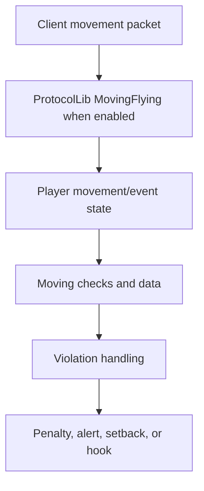
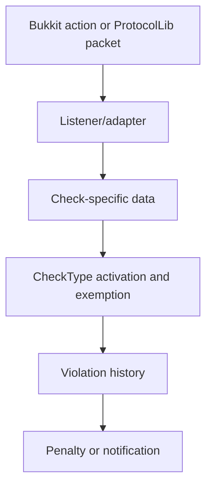

# NoCheatPlus Architecture and Source Map

## Scope

This document maps the Updated-NoCheatPlus code in the companion checkout to the places that decide behavior. It is intentionally source-oriented: a name in a log is not sufficient evidence of a control path.

## Build Topology

The parent Maven project contains these relevant modules:

| Module | Defensive responsibility |
|---|---|
| `NCPCommons` | shared utilities and data structures |
| `NCPLegacy` | Bukkit API compatibility, including modern API support |
| `NCPCore` | checks, data, configuration, permissions, penalties, hooks |
| `NCPCompatBukkit` | reflective and Bukkit compatibility access |
| `NCPCompatProtocolLib` | optional packet-level adapters |
| `NCPPlugin` | plugin bootstrap, descriptors, commands, runtime registration |
| `NoCheatPlus` | assembled plugin artifact |

The default build is `mvn clean package`. Non-free compatibility modules require the repository's documented profiles and locally available server artifacts. Do not infer a server-version guarantee from a directory name alone.

## CheckType Hierarchy

`CheckType` is the main taxonomy and configuration naming source. Names are lower-case dotted paths derived from enum values. The hierarchy includes:

- `checks.moving.survivalfly`
- `checks.moving.creativefly`
- `checks.moving.morepackets`
- `checks.moving.nofall`
- `checks.moving.passable`
- `checks.moving.vehicle.*`
- `checks.fight.angle`, `critical`, `direction`, `fastheal`, `godmode`, `noswing`, `reach`, `selfhit`, `visible`
- `checks.blockbreak.*`
- `checks.blockplace.*`
- `checks.inventory.*`
- `checks.net.*`

The enum also supplies parent relationships, bypass permissions, and active/debug/lag configuration paths. When investigating a setting, begin with `CheckType`, then follow the registered config/data factory.

## Runtime Control Flow

A typical movement investigation should follow this chain:



A fight or block investigation follows a different path and must not be forced through the movement model:



## Packet Adapter Registration

`ProtocolLibComponent` checks whether `NET` or another relevant group is active before registering adapters. Movement packet handling uses `MovingFlying` and `OutgoingPosition`; combat, keepalive, item, velocity, and entity-action adapters are registered conditionally.

A missing alert does not prove a check passed. Possible causes include disabled check activation, missing ProtocolLib, unsupported ProtocolLib, permission exemption, a compatibility branch, or an adapter not being registered.

## Source Reading Procedure

For any reported check:

1. Resolve the user-facing name to `CheckType`.
2. Search for the implementation class and listener registration.
3. Read the check's config and data classes together.
4. Identify all early returns and exemptions.
5. Follow `ViolationHistory`, action/penalty code, and hooks.
6. Read neighboring tests before proposing changes.
7. Reproduce with debug logging and a clean player profile.

## What Not to Assume

- No `PredictionEngine` is implied by the existence of movement checks.
- No `PacketEvents` API exists in this repository.
- A `reach` check is not automatically a 3D ray/AABB implementation.
- A setback is not necessarily controlled by one universal threshold.
- A check name in an external GrimAC guide is not a NoCheatPlus check name.

## Source Evidence Record

Use this record for each finding:

```text
Finding ID: NCP-ARCH-001
Claim: ProtocolLib registers movement packet adapters conditionally.
Grade: A
Source: NCPCompatProtocolLib/.../ProtocolLibComponent.java
Runtime proof: startup log showing adapter registration
Risk: missing adapters can make packet checks appear ineffective
Mitigation: verify dependency version and active CheckType configuration
```

## Defensive Design Insight

The most important boundary is not “which hack is being used”; it is whether the server has a trustworthy view of the player's state. Compatibility adapters, event order, server tick health, and plugin interference can all change that view. Hardening therefore begins with observability and version alignment, not with randomly smaller thresholds.
