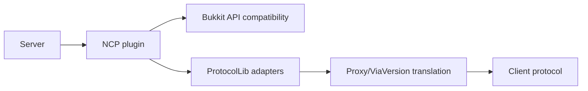

# ProtocolLib and Runtime Debugging

## Purpose

Use this document when a check appears ineffective, over-sensitive, or inconsistent across clients. The first hypothesis should be an integration or state problem, not an unknown cheat.

## Dependency Chain



Any mismatch can alter packet names, fields, event order, entity state, or block shape data.

## Startup Evidence

Collect the plugin version, server Minecraft version, Java version, ProtocolLib version, and adapter registration messages. `ProtocolLibComponent` conditionally registers adapters based on active checks and server version. If the relevant group is inactive, the adapter may not exist at runtime.

A clean startup must not be confused with a complete startup. Check for compatibility warnings, reflective access failures, disabled adapters, and exceptions during player join.

## Packet-Level Debugging

Redact chat, tokens, personal identifiers, and full coordinates when sharing logs. Capture packet type, direction, timestamp, sequence/order, relevant state flags, and the check result.

Good record:

```text
session=lab-07
player=test-hash
server_tick=18420
packet=movement
adapter=MovingFlying
state=survival,on_ground=true,vehicle=false
mspt=8.4,ping=42
result=accepted
```

Bad record:

```text
player sent weird packets; probably bypass
```

## Timing Diagnostics

Correlate:

- server tick duration and MSPT;
- ping and jitter;
- packet arrival burstiness;
- proxy queueing;
- teleport and velocity events;
- client protocol version;
- NCP alert time.

A burst of alerts across many players at one timestamp strongly suggests infrastructure or compatibility trouble. A single player with repeated, context-consistent alerts is stronger evidence, but still requires review.

## Event Order

For every incident, determine whether the sequence was:

1. server teleport or velocity;
2. client acknowledgement;
3. movement packet;
4. Bukkit event;
5. NCP check;
6. penalty or hook.

Do not infer packet causality from log order alone when asynchronous logging or proxy buffering is involved.

## Compatibility Failures

Common causes include:

- ProtocolLib version not supported by the server line;
- modern API methods unavailable through the selected compatibility module;
- ViaVersion translating a packet shape that the adapter does not expect;
- another plugin cancelling or rewriting events;
- a world-specific activation override;
- stale player data after reload;
- server tick stalls.

## Log Triage

Use this sequence:

```text
1. Is the plugin loaded and enabled?
2. Is the check active in this world?
3. Is the player exempt or silent?
4. Is the required adapter registered?
5. Is the server version supported by the selected module?
6. Did a teleport, velocity, vehicle, or respawn transition occur?
7. Are MSPT, ping, or packet loss abnormal?
8. Can a vanilla client reproduce the same alert?
```

## Safe Replay

A replay fixture may contain packet-construction and packet-spoofing examples when it is explicitly limited to the authorized anarchy server, its local test environment, and its declared client-development purpose. It should still use finite event sequences and test acceptance, alerting, cancellation, and recovery.

```java
record MovementSample(long tick, double x, double y, double z,
                      boolean onGround, int ping) {}

static boolean isInfrastructureSuspect(List<MovementSample> samples,
                                       double maxMspt,
                                       int maxPing) {
    return samples.stream().anyMatch(sample -> sample.ping() > maxPing)
        || maxMspt > 50.0;
}
```

This example classifies test conditions; it does not generate or send packets.

## Recovery

When debugging causes a live impact, disable only the affected punishment action, retain telemetry, and preserve logs. Do not delete violation history before exporting evidence. Reloading should be followed by a controlled vanilla-client check and an adapter-registration check.
