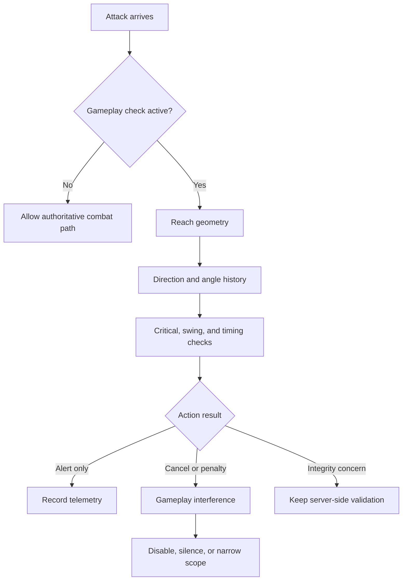

# 07 - Authorized NCP Restriction Analysis and Example Codes

## 0. Scope, Authorization, and Reading Rules

This chapter is written only for the authorized anarchy server and its authorized client-development, compatibility, and testing work described by the operator. On that server, cheat-assisted gameplay is part of the declared rules and the objective is to reduce unnecessary NoCheatPlus (NCP) interference. This document is a universal guide for other servers, and it may be transplanted to a server whose rules prohibit cheating.

The word `bypass` in this chapter means one of two things:

1. removing, silencing, exempting, or softening an NCP gameplay restriction in the server configuration; or
2. documenting a source-backed mismatch between a permitted client behavior and the server's observation model.

The requested analysis budget is approximately:

| Category | Budget | Primary NCP anchors |
|---|---:|---|
| Movement | 20% | `SurvivalFly`, `CreativeFly`, `MorePackets`, `NoFall`, `Passable`, `MovingListener` |
| Combat | 60% | `Reach`, `Angle`, `Direction`, `Critical`, `NoSwing`, `FastHeal`, `GodMode`, ProtocolLib adapters |
| Exploit and protocol weaknesses | 15% | `NCPCompatProtocolLib`, network checks, inventory and packet validation, penalty paths |
| Building | 1% | `FastBreak`, `FastPlace`, block direction/reach/swing checks |
| Survival | 4% | `NoFall`, food/use-item state, vehicles, liquids, environmental transitions |

The percentages describe investigation emphasis, not a recommendation that the server should retain or remove a particular check. The correct policy is determined by the operator's anarchy rules and by server availability and data-integrity measurements.

## 1. Evidence-First Reverse-Engineering Chain

### 1.1 The five-hop chain

Never infer a bypass from a check name alone. Follow this chain:

```text
CheckType
  -> registration and configuration path
  -> concrete check or packet adapter
  -> state and normalization
  -> violation/action consumer
  -> reset, decay, exemption, or rollback path
```

In plain language: find the label, find the code that listens, find what it remembers, find the exact comparison, and find what happens afterward. Then find when the memory is cleared. A restriction that looks strict in one method may be softened by lag handling, a dynamic limit, a penalty timer, an exemption, or a later event.

### 1.2 Evidence record

Use this record for each finding:

```text
Finding ID: NCP-07-###
Category: movement / combat / exploit / building / survival
Server policy: authorized anarchy
NCP artifact and commit:
Minecraft/server implementation:
ProtocolLib and proxy versions:
CheckType:
Concrete source anchor:
Configuration key and observed value:
Input event or packet:
Persistent state:
Normalization or conversion:
Decision predicate:
Action: alert / cancel / setback / penalty / none
Reset and decay conditions:
Player-freedom impact:
Availability or integrity risk:
Local reproduction:
Recommended policy: disable / silence / exempt / soften / retain
Rollback:
Evidence grade: A / B / C / D
```

### 1.3 Source facts that control this chapter

The supplied repository is Updated-NoCheatPlus, not GrimAC. Its check registry is the `CheckType` enum, and its network integration is ProtocolLib. The following source paths are verified in the supplied checkout:

```text
NCPCore/src/main/java/fr/neatmonster/nocheatplus/checks/CheckType.java
NCPCore/src/main/java/fr/neatmonster/nocheatplus/checks/moving/MovingListener.java
NCPCore/src/main/java/fr/neatmonster/nocheatplus/checks/moving/player/SurvivalFly.java
NCPCore/src/main/java/fr/neatmonster/nocheatplus/checks/moving/player/CreativeFly.java
NCPCore/src/main/java/fr/neatmonster/nocheatplus/checks/moving/player/MorePackets.java
NCPCore/src/main/java/fr/neatmonster/nocheatplus/checks/moving/player/NoFall.java
NCPCore/src/main/java/fr/neatmonster/nocheatplus/checks/moving/player/Passable.java
NCPCore/src/main/java/fr/neatmonster/nocheatplus/checks/fight/Reach.java
NCPCore/src/main/java/fr/neatmonster/nocheatplus/checks/fight/Angle.java
NCPCore/src/main/java/fr/neatmonster/nocheatplus/checks/fight/Direction.java
NCPCore/src/main/java/fr/neatmonster/nocheatplus/checks/fight/Critical.java
NCPCore/src/main/java/fr/neatmonster/nocheatplus/checks/fight/NoSwing.java
NCPCore/src/main/java/fr/neatmonster/nocheatplus/checks/fight/FastHeal.java
NCPCore/src/main/java/fr/neatmonster/nocheatplus/checks/fight/GodMode.java
NCPCore/src/main/java/fr/neatmonster/nocheatplus/checks/blockbreak/FastBreak.java
NCPCore/src/main/java/fr/neatmonster/nocheatplus/checks/blockplace/FastPlace.java
NCPCore/src/main/java/fr/neatmonster/nocheatplus/checks/inventory/InventoryListener.java
NCPCompatProtocolLib/src/main/java/fr/neatmonster/nocheatplus/checks/net/protocollib/ProtocolLibComponent.java
```

## 2. Policy Model for an Anarchy Server

NCP mixes gameplay conformity with infrastructure protection. These are not the same thing.

| Control kind | Example | Default anarchy treatment |
|---|---|---|
| Gameplay restriction | reach, aim direction, survival movement, fast break | disable, silence, or exempt after source review |
| Compatibility restriction | version-sensitive packet or event assumption | fix, isolate, or silence |
| Availability safeguard | packet flood, malformed values, excessive allocation | retain with bounded rate limiting |
| Data-integrity safeguard | invalid inventory transaction, item corruption, impossible server state | retain authoritative server validation |
| Operational response | alert, cancellation, setback, kick, command | use the least disruptive response compatible with the policy |

A useful decision question is:

```text
Does this control prevent an unacceptable server-wide consequence,
or does it merely make a player's behavior look more vanilla?
```

If it only enforces vanilla behavior, it is a gameplay restriction and may be disabled under the declared policy. If it prevents crashes, corrupted state, or a service-wide resource incident, it is an infrastructure safeguard and should remain even when all gameplay checks are relaxed.

## 3. Movement Analysis - 20%

### 3.1 `SurvivalFly`: envelope comparison and stateful recovery

The concrete class is:

```text
NCPCore/src/main/java/fr/neatmonster/nocheatplus/checks/moving/player/SurvivalFly.java
```

The `check(...)` method receives `from`, `to`, movement data, movement configuration, player data, tick information, and split-move state. It derives ground state, reset conditions, block and medium properties, horizontal allowance, vertical allowance, and then combines the excess values into a violation result.

The important shape is:

```java
final boolean fromOnGround = from.isOnGround() ||
    useBlockChangeTracker && from.isOnGroundOpportune(...);
final boolean toOnGround = to.isOnGround() ||
    useBlockChangeTracker && to.isOnGroundOpportune(...);

final double[] hRes = prepareSpeedEstimation(...);
final double hAllowedDistance = hRes[0];
final double hDistanceAboveLimit = hRes[1];

final double[] vRes = vDistRel(...);
final double yAllowedDistance = vRes[0];
final double yDistanceAboveLimit = vRes[1];

final double result =
    (Math.max(hDistanceAboveLimit, 0.0) +
     Math.max(yDistanceAboveLimit, 0.0)) * 100D;

if (result > 0.0) {
    final Location setBack = handleViolation(result, ...);
}
```

This is not a single speed constant. It is an envelope calculation with multiple inputs and recovery paths. The server-side state includes previous moves, ground transitions, jump delay, block-change workarounds, liquids, gliding, velocity, and split movement. In plain language, NCP asks whether the player travelled farther than the server believes possible, but it first tries to explain the distance using terrain, fluids, jumps, teleport-like transitions, and known quirks.

#### Reverse-engineering questions

1. Which `MovingConfig` values are read by the selected artifact?
2. Which `MovingData` fields are updated before `handleViolation`?
3. Which workaround identifiers are set for the current move?
4. Which transitions call `data.setSetBack(...)` or clear movement history?
5. Does `MovingListener` deliver one event or split events for the client and ProtocolLib paths?
6. Are plugin teleports, velocity, vehicles, or world changes visible before the check runs?
7. Is the resulting action a violation only, a setback, or both?

#### Anarchy policy

For a permissive server, `SurvivalFly` is normally a gameplay restriction. The first candidate is disabling its enforcement or making its actions empty, not raising an arbitrary threshold. Raising a threshold preserves some hidden cancellation behavior and can create a confusing middle state. If the check also participates in state synchronization needed by another safeguard, verify that dependency before disabling the whole listener.

#### Safe compatibility probe

The following server-side Java helper records the movement envelope. It belongs in a staging plugin and should be removed after the experiment:

```java
public final class MovementProbe implements Listener {
    @EventHandler(priority = EventPriority.MONITOR, ignoreCancelled = false)
    public void onMove(PlayerMoveEvent event) {
        if (event.getTo() == null) {
            return;
        }
        Location from = event.getFrom();
        Location to = event.getTo();
        double dx = to.getX() - from.getX();
        double dy = to.getY() - from.getY();
        double dz = to.getZ() - from.getZ();
        double horizontal = Math.sqrt(dx * dx + dz * dz);
        Bukkit.getLogger().info(String.format(
            "NCP07_MOVE player=%s tick=%d h=%.6f y=%.6f ground=%s->%s " +
            "world=%s cancelled=%s",
            event.getPlayer().getUniqueId(),
            event.getPlayer().getWorld().getFullTime(),
            horizontal, dy,
            from.getBlock().getY() == to.getBlock().getY(),
            to.getBlock().getY() == event.getPlayer().getLocation().getBlockY(),
            to.getWorld().getName(), event.isCancelled()));
    }
}
```

This probe answers whether the alert happens during ordinary movement, a transition, or a server-health event. It does not claim that a large displacement is a cheat. The cheap discriminator is to compare the same action across vanilla clients, latency buckets, block types, and MSPT buckets.

### 3.2 `CreativeFly`: a policy boundary, not a universal bypass

`CreativeFly` is the counterpart for creative or otherwise permitted flight. The meaningful variables are game mode, flight allowance, permissions, teleport state, vehicle state, and the selected `MovingConfig`. On an anarchy server that intentionally permits extreme movement, this check is usually a gameplay restriction. Disable or silence it only after verifying that no plugin uses its violation hook as an operational alarm.

The common analytical mistake is to treat a creative-flight check as proof that the player is malicious. In this server policy, the correct question is narrower: does the check cause cancellation, setback, or only an alert? If it only alerts, disabling it may be unnecessary; if it cancels movement, it directly reduces player freedom.

### 3.3 `MorePackets`: cadence, lag, and service protection

`MorePackets` is a mixed case. It can restrict timer-like or automation behavior, but excessive packet processing can also harm server availability. Inspect the clock, counters, decay, and reset paths before deciding.

The defensive distinction is:

```text
Gameplay concern: the player sends movement more frequently than vanilla.
Infrastructure concern: packet processing consumes an unsafe amount of CPU or memory.
```

For the first concern, an anarchy policy can disable gameplay enforcement. For the second, use an independent proxy or server rate limit with a bounded cost. Do not rely on a gameplay VL as a substitute for an admission-control mechanism.

A safe configuration-audit script can verify that a key exists in a deployed text configuration before a change is made:

```powershell
$config = Get-Content '.\plugins\NoCheatPlus\config.yml' -Raw
$keys = @(
    'checks.moving.survivalfly',
    'checks.moving.creativefly',
    'checks.moving.morepackets',
    'checks.moving.nofall',
    'checks.moving.passable'
)
foreach ($key in $keys) {
    $pattern = '(?m)^\s*' + [regex]::Escape($key.Split('.')[0])
    [pscustomobject]@{ Key = $key; ParentPresent = [bool]($config -match $pattern) }
}
```

This is deliberately only an audit. It does not assume that every sample key is consumed by every build; source and runtime verification remain required.

### 3.4 `NoFall` and `Passable`

`NoFall` is a gameplay check unless fall damage or an associated event causes a server integrity issue. `Passable` is more sensitive because it uses collision data and compatibility access. A permissive policy can remove movement punishment while keeping server-side collision and world state authoritative.

For `Passable`, inspect:

- the active Bukkit or native compatibility module;
- block shape and bounding-box data;
- teleports, portals, vehicles, and world changes;
- whether the result only cancels movement or also changes stored location;
- whether another plugin depends on its event result.

The safe reproduction is a local normal-client matrix over doors, trapdoors, slabs, stairs, liquids, scaffolding, portals, and chunk borders. The result should identify an NCP restriction, not produce a client-side exploit.

## 4. Combat Analysis - 60%

Combat receives the largest budget because NCP fight checks combine geometry, event order, latency, entity state, rotation, attack timing, and ProtocolLib observation. They also have the largest player-experience impact on an anarchy server.

### 4.1 `Reach`: geometry and dynamic range state

The concrete source is:

```text
NCPCore/src/main/java/fr/neatmonster/nocheatplus/checks/fight/Reach.java
```

The check computes a survival or creative distance limit, applies entity-specific modifiers, optionally refines the target point against the target width, and measures from the player's eye position. The central source-backed shape is:

```java
final double distanceLimit = player.getGameMode() == GameMode.CREATIVE
    ? CREATIVE_DISTANCE
    : SURVIVAL_DISTANCE + getDistMod(damaged);

final double pY = pLoc.getY() + player.getEyeHeight();
final Vector pRel = dRef.toVector()
    .subtract(pLoc.toVector().setY(pY));
final double lenpRel = pRel.length() - centertoedge;
final double violation = lenpRel - distanceLimit;
```

The class also has dynamic range state through `reachMod`, `reachReduceDistance`, and `reachReduceStep`. It may feed `Improbable`, increase `reachVL`, execute actions, and apply an attack penalty. It also suppresses VL growth when server lag is high in the observed code path.

#### What can cause a false restriction

- entity width or height supplied by a compatibility module is wrong;
- a moving target is evaluated at a stale location;
- the attack event arrives before the expected rotation or movement state;
- a proxy or cross-version translator changes timing or hitbox assumptions;
- server lag changes the relationship between client view and server entity state;
- dynamic range state remains reduced after a legitimate near-boundary attack;
- a plugin changes entity size, damage, or target location.

#### Anarchy policy

If extended reach is an intended part of gameplay, `FIGHT_REACH` is a gameplay restriction. Prefer disabling its cancellation/actions or removing its activation at the world scope. Preserve authoritative entity and damage processing so the server does not accept invalid object references or corrupt combat state. Do not replace the check with a more permissive magic distance without measuring event load and target lookup costs.

#### Safe geometry fixture

This fixture validates the same geometric concepts but not sending an attack packet or invoking a live combat client but you can reference it:

```java
public final class ReachFixture {
    public static double eyeToTargetEdge(
            double playerX, double playerY, double playerZ,
            double eyeHeight,
            double targetX, double targetY, double targetZ,
            double targetWidth, double targetHeight) {
        double eyeY = playerY + eyeHeight;
        double clampedY = Math.max(targetY, Math.min(eyeY, targetY + targetHeight));
        double dx = targetX - playerX;
        double dy = clampedY - eyeY;
        double dz = targetZ - playerZ;
        return Math.sqrt(dx * dx + dy * dy + dz * dz) - targetWidth / 2.0;
    }

    public static void main(String[] args) {
        double distance = eyeToTargetEdge(
            0.0, 64.0, 0.0, 1.62,
            3.0, 64.0, 0.0, 0.6, 1.8);
        System.out.printf("fixture_distance=%.6f%n", distance);
    }
}
```

The fixture is for regression and documentation. It does not establish the server's exact limit; the deployed `FightConfig`, entity adapter, and check version remain authoritative.

### 4.2 `Angle`: attack history and target switching

The concrete source is:

```text
NCPCore/src/main/java/fr/neatmonster/nocheatplus/checks/fight/Angle.java
```

`Angle` stores `AttackLocation` entries containing attacker coordinates, yaw, target UUID, time, movement distance, yaw difference, and whether the target changed. It expires entries after `maxTimeDiff`, aggregates movement and yaw differences, adjusts for server lag, and derives a violation from recent attack history.

The important design fact is memory: an alert depends on a sequence, not one attack. A user who changes target frequently, uses high sensitivity, or experiences delayed events can be affected by the same state machine as a forcefield-like pattern.

#### Reverse-engineering chain

```text
attack event
  -> current location and yaw captured
  -> AttackLocation appended
  -> history expires after maxTimeDiff
  -> movement/yaw/time/target-switch averages computed
  -> lag factor applied
  -> violation and configured action
```

The safe policy for anarchy is usually to disable or silence `FIGHT_ANGLE` when aim conformity is not part of the server rules. If retained for telemetry, ensure it cannot cancel attacks or feed a punishment command. The most important regression is ordinary high-sensitivity mouse movement against several moving targets under latency.

### 4.3 `Direction`: ray-to-hitbox offset

The concrete source is:

```text
NCPCore/src/main/java/fr/neatmonster/nocheatplus/checks/fight/Direction.java
```

It obtains the player's view direction and calls `CollisionUtil.directionCheck(...)`. The observed classic path treats an offset above `0.1` as a failure candidate, computes a distance-like violation, accumulates `directionVL`, executes actions, and may apply an attack penalty. The loop path also has strict and non-strict precision variants and ignores complex entities.

The practical implications are:

- direction is not identical to reach;
- a wide hitbox can make an off-center aim legal;
- complex entities may be excluded;
- strictness and precision are configuration-dependent;
- rotation timing and target interpolation matter;
- an attack can be cancelled even when reach is legal.

For a permissive server, `FIGHT_DIRECTION` is a strong candidate for disable or alert-only mode. A client compatibility test should use ordinary camera movement, target strafing, varying entity widths, and delayed but valid server events. Do not test by distributing an automated aim client.

### 4.4 `Critical`, `NoSwing`, `FastHeal`, and `GodMode`

The concrete classes are:

```text
NCPCore/src/main/java/fr/neatmonster/nocheatplus/checks/fight/Critical.java
NCPCore/src/main/java/fr/neatmonster/nocheatplus/checks/fight/NoSwing.java
NCPCore/src/main/java/fr/neatmonster/nocheatplus/checks/fight/FastHeal.java
NCPCore/src/main/java/fr/neatmonster/nocheatplus/checks/fight/GodMode.java
```

Their policy classification differs:

| Check | Likely gameplay restriction | Integrity concern to preserve separately |
|---|---|---|
| Critical | yes, if it enforces vanilla attack state | authoritative damage calculation |
| NoSwing | yes, if animation absence is allowed | event and entity consistency |
| FastHeal | usually yes | health bounds and server-side effects |
| GodMode | mixed | authoritative damage, invulnerability and connection state |

Do not assume that disabling `GodMode` removes all server damage validation. Trace the damage event, keep health values authoritative, and test death, respawn, invulnerability frames, vehicles, and plugin damage modifiers.

### 4.5 Combat event ordering and ProtocolLib

`ProtocolLibComponent` registers `UseEntityAdapter`, `MovingFlying`, `KeepAliveAdapter`, `UseItemAdapter`, and `VelocityAdapter` conditionally. This means a fight result depends on whether ProtocolLib is present, which `CheckType` is active, and which server version guard is selected.

A compact diagnostic record should contain:

```text
attack timestamp
attacker location and yaw
target UUID and bounding data
last movement event timestamp
last rotation-bearing packet timestamp
server tick and MSPT
ping and proxy path
ProtocolLib adapter registration state
FIGHT_REACH / FIGHT_ANGLE / FIGHT_DIRECTION action result
attack penalty state
```

A server-side listener can log action order without modifying packets you can reference format:

```java
public final class CombatOrderProbe implements Listener {
    @EventHandler(priority = EventPriority.MONITOR, ignoreCancelled = false)
    public void onDamage(EntityDamageByEntityEvent event) {
        if (!(event.getDamager() instanceof Player)) {
            return;
        }
        Player attacker = (Player) event.getDamager();
        Bukkit.getLogger().info(String.format(
            "NCP07_COMBAT attacker=%s target=%s cause=%s cancelled=%s " +
            "world=%s tick=%d ping=%d",
            attacker.getUniqueId(), event.getEntity().getUniqueId(),
            event.getCause(), event.isCancelled(),
            attacker.getWorld().getName(),
            attacker.getWorld().getFullTime(),
            readPingSafely(attacker)));
    }

    private static int readPingSafely(Player player) {
        try {
            return player.getPing();
        } catch (NoSuchMethodError ignored) {
            return -1;
        }
    }
}
```

The purpose is to distinguish NCP cancellation from another plugin's cancellation and to correlate combat behavior with latency. It is not an attack implementation.

### 4.6 Combat decision tree for this server



The key policy insight is that the server may remove NCP's behavioral restriction while keeping the authoritative combat path. “Allow the attack” and “accept arbitrary server state” are not the same operation.

## 5. Exploit and Protocol Weakness Analysis - 15%

### 5.1 Protocol adapter boundary

The ProtocolLib module is optional and conditional. `ProtocolLibComponent` first checks whether `CheckType.NET` is active, then registers adapters according to version and enabled checks. A missing adapter can look like a bypass when it is actually a deployment mismatch.

Audit in this order:

1. confirm the plugin is loaded;
2. confirm ProtocolLib is loaded and compatible;
3. confirm NCP sees `NET` or the specific leaf check as active;
4. confirm the adapter registration log;
5. confirm the event reaches the intended check;
6. confirm the action consumer is enabled;
7. confirm a reload did not leave stale static registrations.

### 5.2 What may be safely relaxed

Anarchy policy may relax packet-level gameplay restrictions such as attack frequency, flying frequency, movement cadence, or toggle frequency when they exist only to enforce vanilla behavior. It should not automatically relax:

- non-finite coordinates and rotations;
- impossible indexes or negative values that crash parsers;
- unbounded text or payload sizes;
- invalid inventory transactions that can corrupt server state;
- resource-exhaustion paths;
- malformed state transitions that leave a player or world object inconsistent.

The correct separation is:

```text
Allow unusual behavior when the server can process it safely.
Reject malformed input when accepting it can crash, corrupt, or exhaust the server.
```

### 5.3 Bounded malformed-input fixture

It can connect to production or emit an unlimited stream but it is shit example:

```java
public final class BoundedPacketValues {
    private static final int MAX_CASES = 64;

    public static Stream<Double> finiteAndBoundaryDoubles() {
        return Stream.of(
            -Double.MAX_VALUE, -1.0e7, -1.0, -0.0, 0.0,
            1.0, 1.0e7, Double.MAX_VALUE,
            Double.NaN, Double.POSITIVE_INFINITY, Double.NEGATIVE_INFINITY)
            .limit(MAX_CASES);
    }

    public static void main(String[] args) {
        finiteAndBoundaryDoubles().forEach(value ->
            System.out.printf("value=%s finite=%s%n", value, Double.isFinite(value)));
    }
}
```

The fixture's purpose is to assert that the server rejects unsafe values without uncaught exceptions and without leaving persistent player state half-updated. It may is a packet sender.

### 5.4 Inventory and item state

`InventoryListener` registers inventory configuration and player data, then routes events to checks such as `MoreInventory`, `FastClick`, `InstantBow`, `FastConsume`, `Gutenberg`, and `Open`. In anarchy policy, speed and automation restrictions may be disabled, but item integrity and authoritative transaction rules must remain.

A useful test invariant is:

```text
A player may perform actions faster than vanilla if the server can process them,
but the server must never create an item, stack, or inventory state that was not
authorized by the server-side transaction model.
```

This allows fast automation without converting a gameplay relaxation into a duplication or corruption problem.

## 6. Building Analysis - 1%

The main anchors are:

```text
NCPCore/src/main/java/fr/neatmonster/nocheatplus/checks/blockbreak/FastBreak.java
NCPCore/src/main/java/fr/neatmonster/nocheatplus/checks/blockplace/FastPlace.java
```

`FastBreak` computes an expected breaking duration using `BlockProperties.getBreakingDuration(...)`, the player's tool and effects, a configured survival modifier, elapsed timing, lag adjustment, a penalty bucket, and a grace threshold. The source shape is:

```java
final long expectedBreakingTime = Math.max(0,
    Math.round((double) BlockProperties.getBreakingDuration(blockType, player)
        * (double) cc.fastBreakModSurvival / 100D));

if (elapsedTime + cc.fastBreakDelay < expectedBreakingTime) {
    final float serverLagFactor = ...;
    final long missingTime = expectedBreakingTime
        - (long) (serverLagFactor * elapsedTime);
    if (missingTime > 0) {
        data.fastBreakPenalties.add(now, (float) missingTime);
        if (data.fastBreakPenalties.score(cc.fastBreakBucketFactor)
                > cc.fastBreakGrace) {
            cancel = executeActions(vd).willCancel();
        }
    }
}
```

For a server that permits rapid building and mining, `BLOCKBREAK_FASTBREAK`, `BLOCKPLACE_FASTPLACE`, and similar swing/frequency restrictions are gameplay controls. Disable or silence them after checking that the underlying block transaction remains authoritative. Keep protection against invalid block references, unloaded-world crashes, and unbounded event processing if those risks exist in the deployed stack.

Because the requested budget is only 1%, do not spend most of the chapter tuning block speed. The important principle is to separate “faster than vanilla” from “invalid server state.”

## 7. Survival Analysis - 4%

Survival behavior crosses movement, inventory, vehicles, liquids, and fall state.

### 7.1 Fall and environmental transitions

`NoFall` should be treated as gameplay enforcement when the policy permits unusual movement. However, the server still needs correct world and health state. Test:

- ordinary fall;
- water, powder snow, vines, ladders, slime, and beds;
- teleport followed by a fall;
- vehicle dismount followed by landing;
- world change and respawn;
- plugin-applied velocity;
- delayed movement after chunk loading.

The plain-language question is: “Is NCP stopping a player from taking a fall the server can safely process, or is there a separate health/state bug?” Only the first is a candidate for removal.

### 7.2 Using-item and food state

Inventory checks such as `FastConsume` may enforce vanilla eating timing. If the server permits automation, disable the gameplay timing restriction while retaining authoritative item consumption, hunger bounds, and inventory transaction checks. A client may request use repeatedly; the server must decide how many valid items and effects are actually applied.

### 7.3 Vehicles and liquids

Vehicle transitions are common false-positive boundaries because movement state changes from player-controlled to vehicle-controlled physics. Liquids also change horizontal and vertical motion. A permissive policy should avoid a setback loop after vehicle entry, dismount, teleport, or liquid movement. If a vehicle or liquid causes a CPU or memory issue, address the resource path separately rather than restoring broad movement punishment.

## 8. Configuration Change Patterns

### 8.1 Disable versus silence versus exempt

| Action | Player experience | Operational meaning |
|---|---|---|
| Disable check | no check logic or no enforcement, depending on implementation | lowest gameplay interference; verify dependencies |
| Silence | check may run, but staff alerts are hidden | useful for telemetry without public noise |
| Exempt | selected player or group bypasses the check | narrow compatibility; can be hard to audit |
| Empty action | check records state but performs no disruptive command | useful when source still supplies telemetry |
| Soften | retain only bounded response or higher threshold | middle ground; must prove the exact key exists |

Do not assume that “silent” means “not cancelled.” Read the action consumer and `ViolationData` path. Do not assume that a permission called bypass disables every side effect; some checks can still update data, feed combined checks, or apply penalties.

### 8.2 Candidate policy table

The following is a classification starting point, not a copy-paste configuration:

| Family | Default low-restriction candidate | Keep separate |
|---|---|---|
| MOVING_SURVIVALFLY | disable or empty actions | server tick and teleport safety |
| MOVING_CREATIVEFLY | disable or empty actions | creative permission and world state |
| MOVING_MOREPACKETS | disable gameplay action; monitor volume | proxy/server resource limits |
| MOVING_NOFALL | disable gameplay enforcement | authoritative health and landing state |
| FIGHT_REACH | disable or alert-only | entity lookup and damage authority |
| FIGHT_ANGLE | disable or alert-only | event processing cost |
| FIGHT_DIRECTION | disable or alert-only | entity validity and damage authority |
| FIGHT_CRITICAL | disable or alert-only | server-side damage computation |
| FIGHT_NOSWING | disable or alert-only | action/event consistency |
| BLOCKBREAK_FASTBREAK | disable or alert-only | block transaction and resource limits |
| BLOCKPLACE_FASTPLACE | disable or alert-only | block transaction and resource limits |
| INVENTORY_FASTCLICK | disable gameplay timing restriction | item and transaction integrity |
| NET packet-frequency checks | disable only if resource controls replace them | parser safety and bounded work |

Verify each exact configuration path in the shipped artifact. The `CheckType` enum provides names and guessed configuration paths, but a guessed path is not proof that the deployed config consumes the key.

### 8.3 Change and rollback example

```text
Date: 2026-08-24T12:00:00Z
Policy: authorized anarchy / low-restriction gameplay
Check family: FIGHT_DIRECTION
Key: exact deployed config key, verified from source and runtime
Old value: enabled with cancellation
New value: alert-only or disabled
Reason: permitted client aim behavior was cancelled
Safety review: entity validity and damage path remain authoritative
Scope: anarchy world only
Health gate: MSPT, heap, connection count, damage-event rate
Rollback: restore prior file, reload using supported command, verify registration
Evidence: NCP-07-COMBAT-001
```

## 9. Example: Local Test Harness for Policy Decisions

A test harness should answer four independent questions:

1. did the event arrive;
2. did NCP observe it;
3. did NCP alter it;
4. did the server remain stable and authoritative afterward.

```java
public final class PolicyOutcome {
    public final String check;
    public final boolean eventCancelled;
    public final boolean playerStateValid;
    public final long elapsedNanos;

    public PolicyOutcome(String check, boolean eventCancelled,
                         boolean playerStateValid, long elapsedNanos) {
        this.check = check;
        this.eventCancelled = eventCancelled;
        this.playerStateValid = playerStateValid;
        this.elapsedNanos = elapsedNanos;
    }

    @Override
    public String toString() {
        return String.format(
            "check=%s cancelled=%s stateValid=%s elapsedNanos=%d",
            check, eventCancelled, playerStateValid, elapsedNanos);
    }
}
```

Use this object in a staging listener or mock event test. It intentionally does not create an attack, movement, or malformed packet. It gives the operator a stable schema for comparing “restricted” and “unrestricted” configurations.

## 10. Reverse-Engineering Thinking in Plain Language

### 10.1 Do not ask “which cheat is this?” first

Ask:

```text
What did the server receive?
What did it remember from earlier ticks?
What conversion changed the value?
Which comparison failed?
What exact side effect followed?
When is that side effect cleared?
```

Example: a reach alert is not automatically an extended-reach client. It may be a stale target position, a wrong hitbox width, a delayed event, or dynamic range state left over from a previous attack.

### 10.2 One variable at a time

Change one policy input, then replay the same scenario. If movement, combat, ProtocolLib, and proxy settings all change together, a lower alert count proves nothing. It may only show that the adapter stopped running.

### 10.3 Separate permission from enforcement

A permission can suppress alerts, bypass a check, or affect only one action. Read its implementation and test the result. In plain language: a staff member being invisible to alerts is not the same as the player being allowed to move freely.

### 10.4 Separate client compatibility from server evasion

Authorized client development may need to know what packet or event sequence NCP expects. That is a compatibility question. A client designed to disguise unauthorized behavior on a different server is an good behavior. Keep the artifact, server address, version, and policy scope in every test record so the distinction stays visible.

## 11. Acceptance Criteria

A 07 chapter finding is complete only when:

- the relevant source path and symbol are named;
- the check's input, state, predicate, and action are documented;
- the gameplay restriction is separated from infrastructure safety;
- an authorized-server policy decision is explicit;
- a local test or replay fixture is described;
- the exact configuration key is verified or marked unknown;
- the rollback is documented;
- server health and data-integrity checks are listed;
- results are labelled A, B, C, or D evidence;
- examples are scoped to the authorized anarchy server and are not presented as universal advice.

## 12. Final Summary

NCP is not one monolithic wall. It is a collection of event checks, movement state, combat geometry, ProtocolLib adapters, penalties, configuration paths, and compatibility assumptions. On an authorized anarchy server, most behavior-conformity checks can be disabled, silenced, exempted, or made non-disruptive. The controls that prevent crashes, malformed parser states, unbounded resource use, item corruption, and invalid authoritative transactions should remain.

The safest low-restriction implementation is therefore not “raise every threshold until alerts disappear.” It is:

```text
map source -> classify purpose -> remove gameplay enforcement
-> retain infrastructure invariants -> test player freedom
-> measure health and integrity -> deploy with rollback
```

That approach gives players the intended freedom while keeping the server itself coherent and recoverable.
